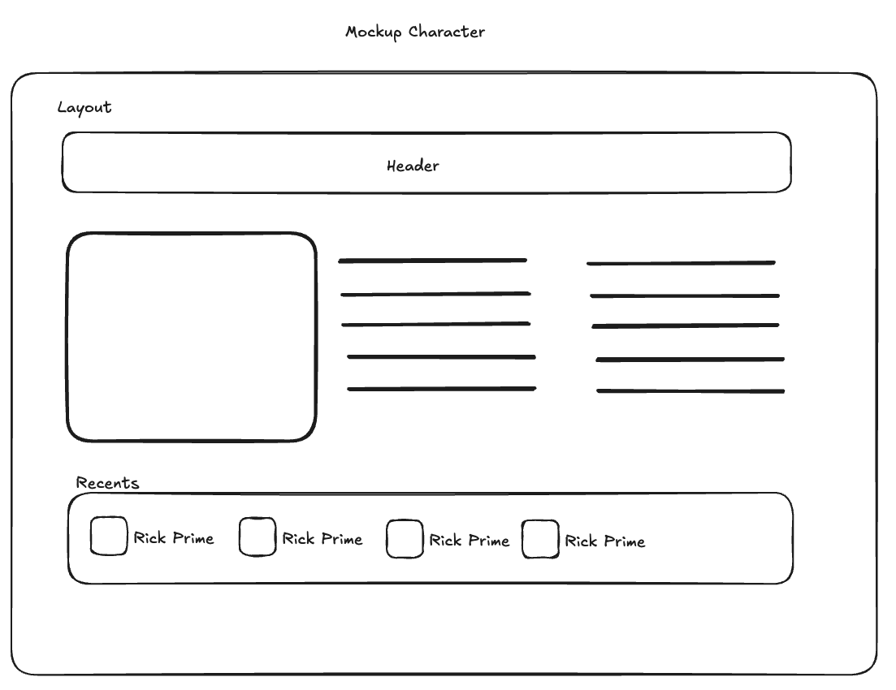

# Rick and Morty

Challenge 

- [Nextjs 14 with App Router](https://nextjs.org/docs/app/building-your-application/routing)
- [TailwindCSS](https://tailwindcss.com/)
- [React Query](https://react-query.tanstack.com/)


## Getting Started

First, install dependencies with yarn:

```bash
yarn install
```

Second, create .env.local file:

```bash
touch .env.local
```

And add the following content to it:

```bash
NEXT_PUBLIC_API_BASE_URL="https://rickandmortyapi.com/api"
```

Third one, run the development server:

```bash
yarn dev
```

Open [http://localhost:3000](http://localhost:3000) with your browser to see the result.


## Rick And Morty

- API Docs: [`R & M`](https://rickandmortyapi.com/)
- Excalidraw share [`Live`](https://excalidraw.com/#room=ce074148f82794b6fb20,oLA3q3OLxDJYZs66C-Y3OA)

## Mockup




## Component Architecture

Server vs Client composition


### Characters

- Character List


### Character

- Character Details


## Running Tests

### Unit Tests
To run unit tests:
```bash
yarn test
```

To run tests with coverage:
```bash
yarn test:cv
```

To run tests in watch mode:
```bash
yarn test:watch
```

### End-to-End (E2E) Tests
To run e2e tests using Playwright:
```bash
yarn test:e2e
```

For a UI mode to inspect test results:
```bash
yarn test:e2e:ui
```

## Important Libraries

### Core Libraries
- **Next.js**: The React framework used for building the application.
- **React**: Core library for building the UI.
- **Zustand**: A lightweight state management library.

### Testing Libraries
- **Jest**: JavaScript testing framework for unit tests.
- **Testing Library (React/DOM)**: Testing utilities for React components.

### E2E Testing
- **Playwright**: A powerful framework for end-to-end testing.

### Code Quality
- **ESLint**: Linter for maintaining code quality.
- **Prettier**: Code formatter for consistent styling.
- **Prettier Plugin for TailwindCSS**: Ensures Tailwind classes are ordered.

### Styling
- **TailwindCSS**: Utility-first CSS framework.
- **Sass**: Preprocessor for writing more maintainable CSS.

## Additional Scripts

### Formatting Code
Run Prettier to format your code:
```bash
yarn format
```

### Linting Code
Run ESLint to check for issues:
```bash
yarn lint
```